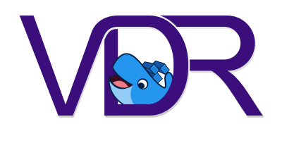

[](http://www.tvdr.de/)

The Video Disk Recorder ([VDR](http://www.tvdr.de/)) is a free (open source), non-commercial project from Klaus Schmidinger to create a digital video recorder using standard PC components. It is possible to receive, record and playback digital TV broadcasts compatible with the DVB standard.


# [lapicidae/vdr-server](https://github.com/lapicidae/vdr-server)

[](https://github.com/lapicidae/vdr-server)
[](https://hub.docker.com/r/lapicidae/vdr-server)
[](https://hub.docker.com/r/lapicidae/vdr-server)
[](https://github.com/lapicidae/vdr-server/actions/workflows/docker.yml)


Image based on [Arch Linux](https://hub.docker.com/_/archlinux), [VDR4Arch](https://github.com/VDR4Arch/vdr4arch) and [s6-overlay](https://github.com/just-containers/s6-overlay).


## Features

* regular and timely application updates
* easy user mappings (PGID, PUID)
* plugin [ciplus](https://github.com/ciminus/vdr-plugin-ciplus), [ddci2](https://github.com/jasmin-j/vdr-plugin-ddci2) and [dvbapi](https://github.com/manio/vdr-plugin-dvbapi) support
* eMail notifications via [msmtprc](https://marlam.de/msmtp/) - a very simple and easy to use SMTP client
* adjustable niceness and I/O scheduling priority
* built-in png [channel logos](https://github.com/lapicidae/svg-channellogos)
* daily [naludump](https://www.udo-richter.de/vdr/naludump.html) cron
* simple [web server](https://git.busybox.net/busybox/tree/networking/httpd.c) to provide channel logos, epg images (e.g. for [plugin-roboTV](https://github.com/pipelka/vdr-plugin-robotv/)), m3u channel list and XMLTV file (e.g. for [Jellyfin](https://jellyfin.org/)).
* integrate your own PKGBUILD packages
* log to file with built-in log rotation
* creation of a VDR channel ID list

### *Note*
The image is automatically rebuilt when any of the following sources receive an update:

* [Arch Linux](https://hub.docker.com/_/archlinux) Official Docker Image - latest
* [VDR4Arch](https://github.com/VDR4Arch) GitHub repository


## Getting Started

### Usage
Here are some example snippets to help you get started creating a container.

> :warning: **WARNING: The first start might be slow.**  
> The first start can take longer, as non-integrated plugins are built from the [AUR](https://aur.archlinux.org/).

#### *docker-compose (recommended)*
Compatible with docker-compose v2 schemas.
```yaml
services:
  vdr-server:
    image: ghcr.io/lapicidae/vdr-server
    container_name: vdr-server
    environment:
      - PUID=1000
      - PGID=1000
      - LANG=de_DE.UTF-8
      - TZ=Europe/Berlin
      - PLUGINS=epgsearch live streamdev-server vnsiserver    #optional
    volumes:
      - /path/to/system:/vdr/system
      - /path/to/config:/vdr/config
      - /path/to/recordings:/vdr/recordings
      - /path/to/cache:/vdr/cache
    ports:
      - 8008:8008
      - 3000:3000
      - 34890:34890
    devices:
      - /dev/dvb:/dev/dvb     #optional
    # -------------------- STRICTLY NECESSARY --------------------
    cap_add:
      - SYS_NICE 
    security_opt:
      - "seccomp=unconfined"
    ulimits:
      nice:
        soft: -20
        hard: -20
      rtprio:
        soft: 99
        hard: 99
    stop_grace_period: 60s    # Required for clean shutdown
    # ------------------------------------------------------------
    restart: unless-stopped
```

#### *docker cli (example)*
```bash
docker run -d \
  --name=vdr-server \
  -e PUID=1000 \
  -e PGID=1000 \
  -e LANG=de_DE.UTF-8 \
  -e TZ=Europe/Berlin \
  -e PLUGINS="epgsearch live streamdev-server vnsiserver" \
  -p 8008:8008 \
  -p 3000:3000 \
  -p 34890:34890 \
  -v /path/to/system:/vdr/system \
  -v /path/to/config:/vdr/config \
  -v /path/to/recordings:/vdr/recordings \
  -v /path/to/cache:/vdr/cache \
  --device /dev/dvb:/dev/dvb \
  --cap-add=SYS_NICE \
  --security-opt seccomp=unconfined \
  --ulimit nice=-20:-20 \
  --ulimit rtprio=99:99 \
  --stop-timeout 60 \
  --restart unless-stopped \
  ghcr.io/lapicidae/vdr-server
```

#### ***Important: Permissions and Threading***
To ensure smooth video processing and prevent dropped frames, VDR attempts to set higher-priority scheduling for its internal threads.  
Without specific configuration, for example, the error `ERROR (thread.c,259): Permission denied` will appear in your logs.  
Furthermore, a proper shutdown window is essential to avoid data loss.

The following options are **strictly necessary**:

  * `cap_add - SYS_NICE`: Grants the container the kernel capability to raise process priority and set real-time scheduling policies.
  * `security_opt - "seccomp=unconfined"`: Bypasses the default Docker security profile that often restricts the `sched_setscheduler` system call.
  * `ulimits - nice`: Defines the range of "niceness" available to the container. Setting this to `-20` allows VDR to reach the highest possible priority.
  * `ulimits - rtprio`: Allows VDR to use Real-Time (RT) scheduling, critical for handling DVB data streams without interruption.
  * `stop_grace_period / --stop-timeout`: VDR requires time to stop active recordings and save its state properly. Setting this to `60s` prevents the container from being killed prematurely.

### Parameters
Container images are configured using parameters passed at runtime.  
These parameters are separated by a colon and indicate `<external>:<internal>` respectively.  
For example, `-p 8080:80` would expose port `80` from inside the container to be accessible from the host's IP on port `8080` outside the container.

| Parameter | Function |
| :--- | :--- |
| **Required** | |
| `--cap-add=SYS_NICE` | Allows adjusting niceness and real-time scheduling priorities |
| `--security-opt seccomp=unconfined` | Required for the kernel to apply scheduling and priority changes |
| `--ulimit nice=-20:-20` | Sets the priority range (soft:hard) to the highest level |
| `--ulimit rtprio=99:99` | Sets the real-time priority limit (soft:hard) for DVB streaming |
| `--stop-timeout 60` | Ensures VDR can finish recordings and save state before stopping |
| **System** | |
| `-e PUID=1000` | [UserID](#user--group-identifiers) for file permissions |
| `-e PGID=1000` | [GroupID](#user--group-identifiers) for file permissions |
| `-e TZ=Europe/London` | Specify a [timezone](https://en.wikipedia.org/wiki/List_of_tz_database_time_zones#List) |
| `-e LANG=en_US.UTF-8` | Default locale; see [list](https://sourceware.org/git/?p=glibc.git;a=blob_plain;f=localedata/SUPPORTED;hb=HEAD) |
| `-v /vdr/system` | Start parameters, recording hooks and msmtprc config |
| `-v /vdr/config` | Config files (e.g. `setup.conf` or `channels.conf`) |
| `-v /vdr/recordings` | Recording directory (video directory) |
| `-v /vdr/cache` | Cache files (e.g. `epgimages` or `cam.data`) |
| `--device /dev/dvb` | Passthrough for DVB hardware (required for reception) |
| **Networking** | |
| `-p 8008` | HTTP VDR-Live plugin |
| `-p 3000` | Streamdev Server (http Streaming) [^1] |
| `-p 8009` | HTTPS VDR-Live plugin (requires your own certificate) |
| `-p 6419` | Simple VDR Protocol (SVDRP) |
| `-p 6419/udp` | SVDRP Peering |
| `-p 2004` | Streamdev Server (VDR-to-VDR Streaming) |
| `-p 34890` | [Kodi](https://kodi.wiki/view/Add-on:VDR_VNSI_Client) VDR-Network-Streaming-Interface (VNSI) |
| `-p 8099` | HTTP port for the simple Web Interface [^2] |
| **Config** | |
| `-e PLUGINS="..."` | **Space separated** list of [VDR Plugins](https://github.com/VDR4Arch/vdr4arch/tree/master/plugins) |
| `-e LOG2FILE=true` | Write log to file in `/vdr/log` |
| `-e PROTECT_CAMDATA=true` | Write protect `cam.data` to avoid unwanted changes |
| `-e DISABLE_WEBINTERFACE=true` | Disable web interface (live plugin) |
| `-e LOGO_COPY=false` | Use your own station logos in `/vdr/channellogos` |
| `-v /vdr/channellogos` | TV and radio station logos |
| `-v /vdr/log` | Logfiles if `LOG2FILE=true` |
| `-v /vdr/timeshift` | VNSI Time-Shift buffer directory |
| `-v /vdr/pkgbuild` | Path for custom build packages |
| **VDR Priority** *(needs `SYS_NICE`)* | |
| `-e NICE=-1` | Adjusted niceness via [renice](https://man.archlinux.org/man/renice.1) (default: `0`) |
| `-e IONICE_CLASS=2` | I/O scheduling class via [ionice](https://man.archlinux.org/man/ionice.1) (default: `0`) |
| `-e IONICE_PRIO=3` | I/O scheduling priority via [ionice](https://man.archlinux.org/man/ionice.1) (default: `0`) |
| **Extras** | |
| `-e START_NALUDUMP=true` | Start [naludump](https://www.udo-richter.de/vdr/naludump.html) daily at 4 am [^3] |
| `-e START_NALUDUMP_AT=...` | Crontab schedule for naludump (default: `0 4 * * *`) |
| `-e START_WEBSERVER=true` | Web interface with support for live streaming and asset delivery (port: `8099`) [^2] |
| `-e START_XMLTV=true` | Generate m3u and [XMLTV](http://xmltv.org/) daily at 12 am [^4] |
| `-e START_XMLTV_AT=...` | Crontab schedule for XMLTV creation (default: `0 0 * * *`) |
| `-e XMLTV_DAYS=3` | Number of days in xmltv file (default: `7`) |
| `-e XMLTV_DOMAIN_NAME=...` | Hostname/IP used in the m3u file (e.g. `vdr.example.com`) |
| `-e XMLTV_STREAM_PORT=4561` | Video stream port in m3u (default: `3000`) |
| `-e XMLTV_LOGO_PORT=1654` | Web server port for station logos in m3u (default: `8099`) |
| `-e XMLTV_LOGO_URL=...` | URL for external **png** station logos (e.g. `https://example.com/logos`) |
| **Not recommended** | |
| `--cap-add=SYS_TIME` | **Warning:** Allows the container to change the Host's system clock [^5] |

### User / Group Identifiers
When using volumes (`-v` flags) permissions issues can arise between the host OS and the container, we avoid this issue by allowing you to specify the user `PUID` and group `PGID`.

Ensure any volume directories on the host are owned by the same user you specify and any permissions issues will vanish like magic.

In this instance `PUID=1234` and `PGID=4321`, to find yours use `id user` as below:

```bash
  $ id username
    uid=1234(dockeruser) gid=4321(dockergroup) groups=4321(dockergroup)
```


## VDR Configuration

### Directory Structure
Standard paths and their Container counterpart.

* /etc/vdr -> /vdr/system
* /var/lib/vdr -> /vdr/config
* /srv/vdr/video -> /vdr/recordings
* /var/cache/vdr -> /vdr/cache
* /usr/share/vdr/channel-logos -> /vdr/channellogos


### Application Setup
**Please read the [VDR Wiki](http://www.vdr-wiki.de/).**  

Command line parameters can be changed in `vdr/system/conf.d/00-vdr.conf` and  
configuration files are located in `vdr/config/`.

WebUI ([live plugin](https://github.com/MarkusEh/vdr-plugin-live)) can be found at `http://<your-ip>:8008`.  
Most VDR settings can be edited via the remote control in the WebUI.

### Plugins
First, see if there is anything to adjust in the "WebUI / Remote Control" section.

Parameters are passed via the corresponding file in `vdr/system/conf.d/`.  
Most other files related to plugins are located in `vdr/config/plugins/`.

### eMail Notification
For example, the VDR plugin [epgsearch](https://github.com/vdr-projects/vdr-plugin-epgsearch) can send a notification by e-mail (sendmail).  
To provide sendmail functionality [msmtp](https://marlam.de/) is used and the configuration is done in `vdr/system/eMail.conf`.  
Please refer to the [msmtp documentation](https://marlam.de/msmtp/documentation/) for configuration instructions.


## Bonus

### Channel IDs
A list of VDR channel IDs is automatically created when the container is stopped and can be found in `vdr/cache/channelids.conf`.

### Recording Error Check
Scan the recordings before 'VDR 2.6.0' for errors (continuity counter), e.g. to display them in the web interface.  
Just put an empty file named `checkrec` into the main directory of your recordings (`vdr/recordings`).  
The process is executed at container start and runs until everything is checked.  
The check is done via [vdr-checkts](https://github.com/vdr-projects/vdr-checkts) by [eTobi](http://e-tobi.net) and the basic script comes from [MarkusE](https://www.vdr-portal.de/forum/index.php?thread/134607-alte-aufzeichnungen-fehlerhaft/&postID=1342589#post1342589).


## Support the VDR Project
While VDR is free and open-source, the developers enjoy knowing how many people use their software.  
If you enjoy using VDR, please consider registering at the official **[VDR User Counter](https://www.tvdr.de/counter.htm)**. 

> "Developing a program is more fun if the programmers know that it is being used by a great many people."  
> *Klaus Schmidinger*


## Thanks

* **[Klaus Schmidinger (kls)](http://www.tvdr.de/)**
* **[vdr-portal.de](https://www.vdr-portal.de/)**
* **[VDR4Arch](https://github.com/VDR4Arch)**
* **[Tobias Grimm (eTobi)](http://e-tobi.net)**
* **[just-containers](https://github.com/just-containers)**
* **[linuxserver.io](https://www.linuxserver.io/)**
* **...and all the forgotten ones**


[//]: # (Footnotes)
[^1]: Simple interface is avalable at `http://<your-ip>:3000`
[^2]: When the web interface is running, you will find instructions on how to use media assets (xmltv, epgimages, iptv) at: `http://<your-ip>:8099/assets_usage.html`
[^3]: WARNING: The whole process has been designed to be as safe as possible! Nevertheless, there is no guarantee that the recordings will not be damaged during the cleanup.
[^4]: Plugin `streamdev-server` is required for playback. The default server in m3u for channels and channel images is the [network alias](https://docs.docker.com/engine/reference/run/#network-settings) of the container. Currently, only the German language is fully supported when converting to XMLTV format.
[^5]: If you want to use VDRs `"SetSystemTime = 1"` use parameter `"--cap-add=SYS_TIME"` **(untested)**
